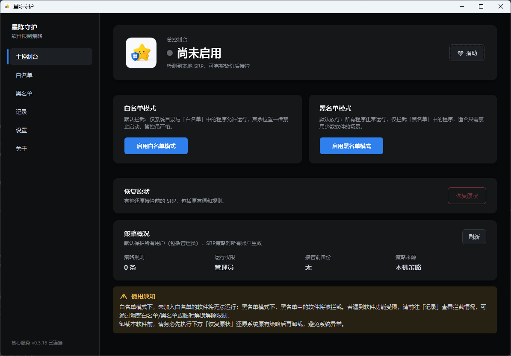
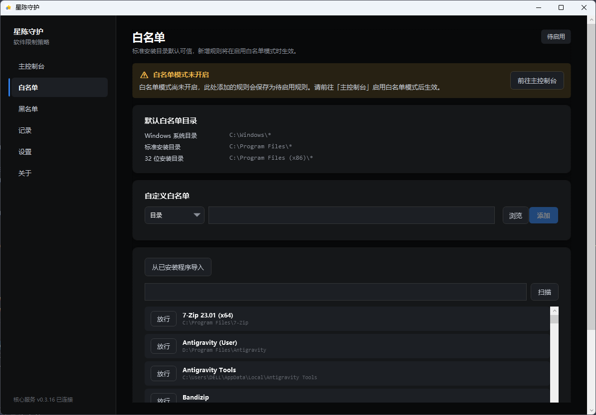
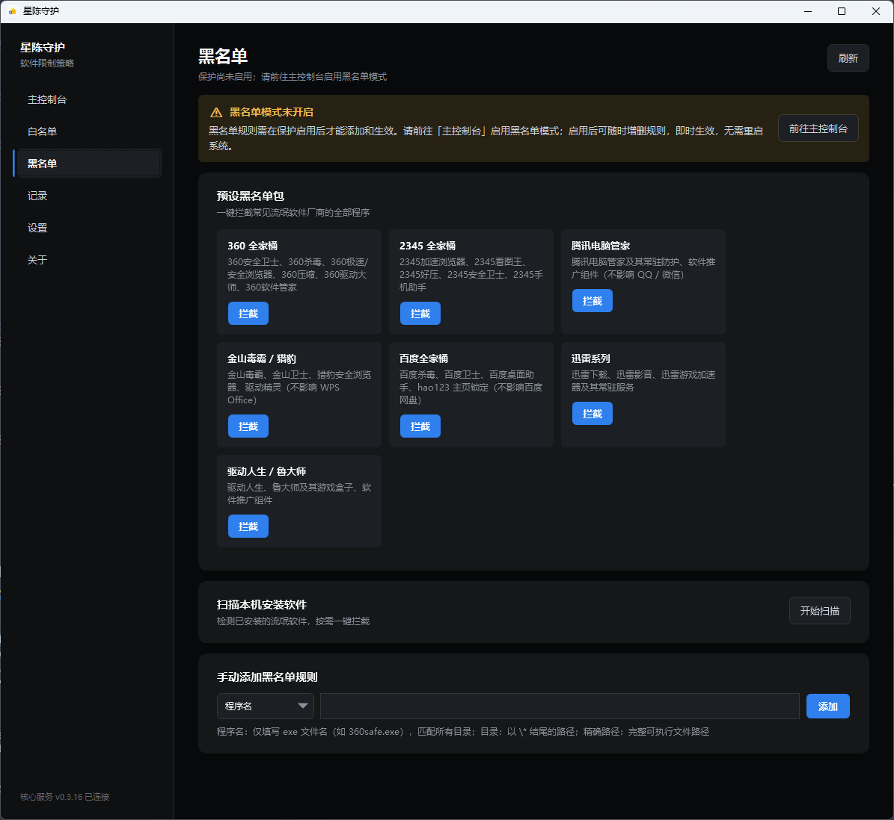
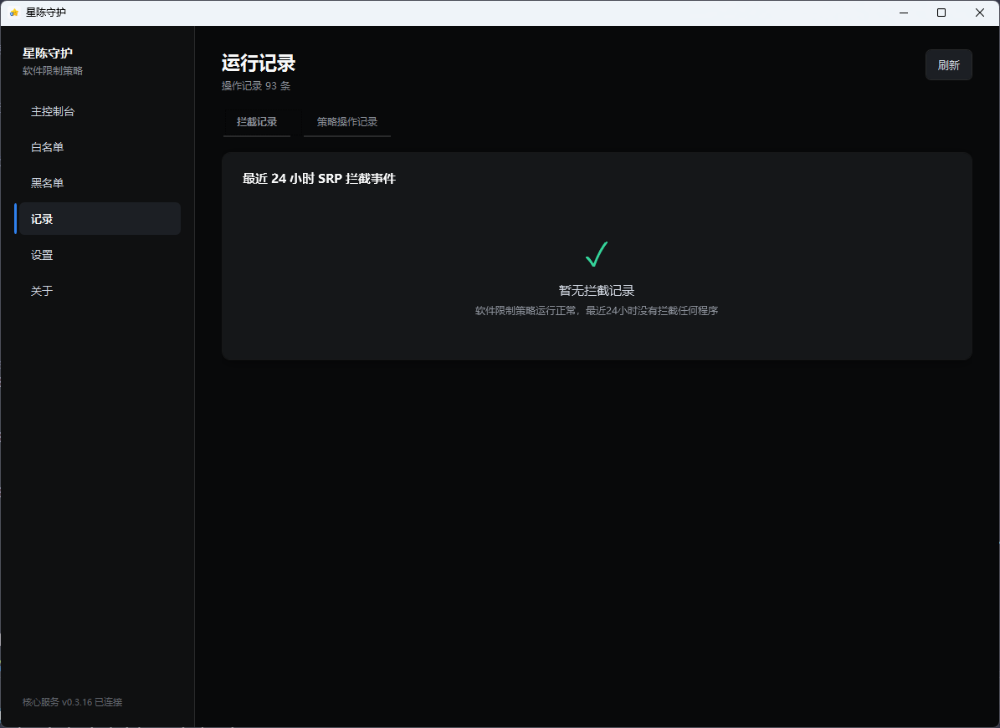
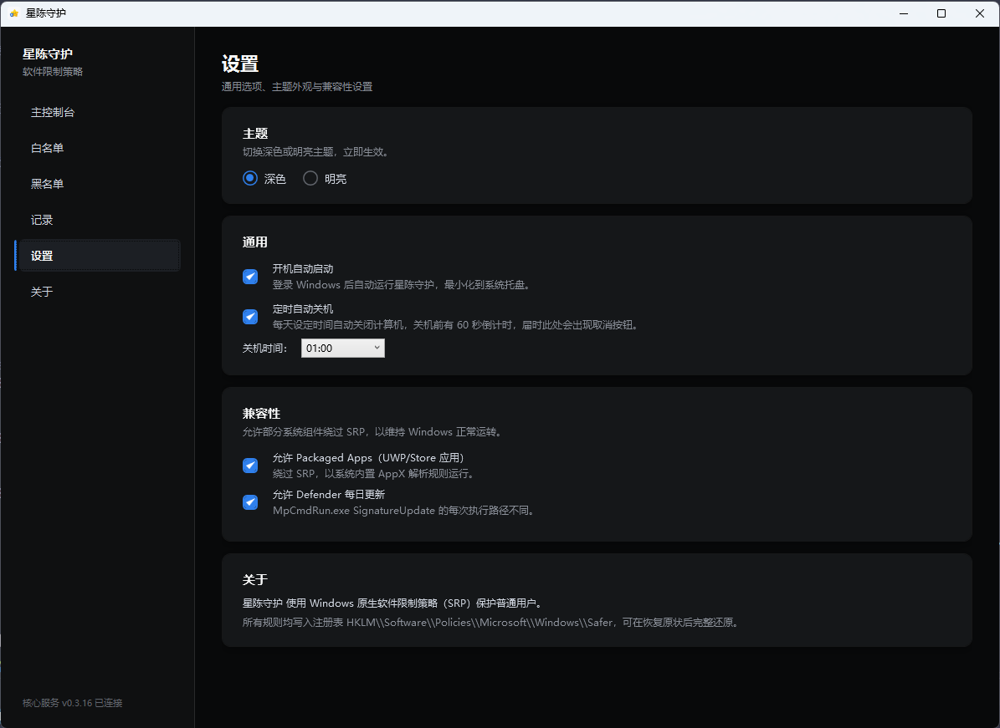
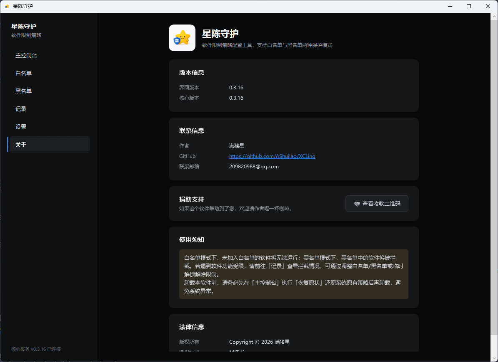

<div align="center">

<p align="center">
    ⭐ 星陈守护（XCLing）—— 一个简洁、安全、开箱即用的 Windows 软件限制策略（SRP）管理器 🇨🇳
</p>
<p align="center">
  <a href="https://github.com/AShujiao/XCLing"></a>
  <a href="https://github.com/AShujiao/XCLing/releases"></a>
  <a href="LICENSE"></a>
</p>
</div>

# ⭐ 星陈守护（XCLing）

> **一个简洁、安全、开箱即用的 Windows 软件限制策略（SRP）管理器** 🇨🇳

星陈守护（工程代号 **XCLing**）以原生 WPF 图形界面提供两种保护模式  
  **🟢 白名单模式**（默认只允许可信软件运行）  
  **🔴 黑名单模式**（默认放行，只拦黑名单软件）  
  并围绕 **启用保护 → 临时解锁 → 重新锁定 → 恢复原状** 的完整生命周期组织全部操作。

- 🖥️ 原生 Windows 界面：WPF (.NET Framework 4.8) + Go sidecar，覆盖 **Win7 SP1 ~ Win11**
- 🔒 写入即安全：完整备份、回读校验、失败自动回滚，恢复记录仅管理员可读
- 🚫 专治全家桶：内置 360 / 2345 / 腾讯电脑管家 等 7 个厂商预设拦截包
- 🔇 默认不联网、无遥测、无 WebView2（仅点击「检查更新」时访问 GitHub），轻量驻留系统托盘
- 📦 开源地址：[github.com/AShujiao/XCLing](https://github.com/AShujiao/XCLing)，欢迎 **Star ⭐ / Issue 🐛 / PR 🔀**

---

## 💡 开发初衷

很多电脑越用越卡，其实不是硬件不行，而是被「**全家桶**」悄悄塞满了：下载一个软件，安装时顺手勾上"安全卫士"、浏览器、压缩工具、手机助手……一不留神，桌面多出一排从没装过的软件，开机越来越慢、弹窗越来越多、风扇越转越响。

**星陈守护**正是为解决这个问题而生的，它尤其想帮到这两类人：

- 🐢 **低配置电脑用户**：硬件资源本就不宽裕，经不起全家桶的折腾。白名单模式下只放行可信软件，把每一分性能都留给真正需要的程序。
- 🧒 **电脑小白**：看不懂注册表、不敢碰策略组、怕删错文件。星陈守护把复杂的 SRP（软件限制策略）封装成几个按钮——**启用保护 → 临时解锁 → 重新锁定 → 恢复原状**，不懂原理也能用，出问题还能一键还原。

它做的是**减法**：不占资源、不联网、不弹窗、不打扰，安安静静拦下那些"不请自来"的软件，还电脑一个干净、流畅的环境。

---

## 🎯 功能特性

### 🖥️ 主控制台
- 一键启用 **白名单保护** 或 **仅拦截模式**，两种模式互斥，切换需先「恢复原状」
- **临时解锁 / 重新锁定 / 恢复原状** 三个核心动作始终可见
- **策略概况**面板：规则数、运行权限（是否管理员）、接管前备份、策略来源
- 始终展示「使用须知」⚠️：卸载前务必先「恢复原状」，避免系统异常

### 📂 放行规则（白名单）
- 默认可信 **C:\Windows、Program Files、Program Files (x86)**、WindowsApps、Defender 平台等系统目录，并自动放行**本程序自身**
- 手动添加绿色软件目录或精确程序路径（原生文件对话框，非模拟器）
- 规则增删**立即生效**，失败自动回滚；系统基础规则与自身规则不可删除
- 🚧 **禁止放行整个用户可写目录**（预检拦截），扫描已安装软件仅作为辅助导入

### 🚫 拦截名单（黑名单）
- 三种规则形态：**裸文件名**（任意目录匹配，改名/移动/重装都能挡）、**目录**、**精确文件**
- 📦 内置 **7 个厂商预设包**，一键整组应用或移除：

| 预设包 | 覆盖内容 |
| --- | --- |
| 360 全家桶 | 安全卫士、杀毒、极速/安全浏览器、压缩、驱动大师、软件管家 |
| 2345 全家桶 | 加速浏览器、看图王、好压、安全卫士、手机助手 |
| 腾讯电脑管家 | 管家及常驻防护、软件推广组件（不影响 QQ / 微信） |
| 金山毒霸 / 猎豹 | 毒霸、卫士、猎豹安全浏览器、驱动精灵（不影响 WPS） |
| 百度全家桶 | 杀毒、卫士、桌面助手、hao123 主页锁定（不影响百度网盘） |
| 迅雷系列 | 下载、影音、游戏加速器及常驻服务 |
| 驱动人生 / 鲁大师 | 驱动工具及游戏盒子、推广组件 |

- 🔍 **扫描本机已安装软件**：按厂商匹配已知垃圾软件，批量拦截实际安装目录
- 🧠 拦目录时自动派生目录内 `.exe` 的**文件名规则**，挡住在目录外复活的服务副本 / 看门狗进程
- 💥 新增规则后 best-effort 结束命中的**存量进程**（SRP 只拦新进程创建），带安全护栏

### 📋 记录
- 保存**启用、解锁、锁定、恢复、规则增删、定时关机**等操作记录（最近 200 条）
- 只读展示 Windows 事件日志中的**拦截事件**（纯 `wevtutil qe`，关键词永不进命令行）

### ⚙️ 设置
- 🎨 深色 / 明亮主题切换，立即生效、持久化记忆（默认深色）
- 🚀 开机自启动开关（**默认启用**，登录后最小化到托盘）
- ⏰ 定时自动关机：每日指定小时，关机前 **60 秒倒计时**，可一键取消
- 🧩 兼容性选项：允许 **Packaged Apps（UWP/Store 应用）** 绕过 SRP；允许 **Defender 每日更新**

### 🖱️ 系统托盘 & 常驻
- 托盘菜单：**打开控制台 / 临时解锁 / 重新锁定 / 退出**，双击图标打开主窗口
- 关闭主窗口**驻留托盘**，不退出进程
- 🔄 **单实例**：重复启动只唤起已驻留的主窗口（命名互斥体 + 唤起事件），不产生第二个进程

### 🚀 开机自启动
- 优先注册「**登录触发、最高权限**」的计划任务 `XCLing`，登录后**以管理员权限**直接进入托盘
- 无权限注册任务时**回退**到当前用户 Run 键（⚠️ Run 键会被 Windows 静默跳过需要提权的程序，计划任务不受此限制）
- 自启动带 `--minimized` 参数直接驻留托盘；勾选状态以 `HKCU\Software\XCLing\AutoStartEnabled` 偏好为准

### 💝 关于 / 捐赠
- 关于页说明 SRP 写入位置（`HKLM\Software\Policies\Microsoft\Windows\Safer`）与恢复保证
- 🔄 **检查更新**：基于 GitHub Releases 检查新版本（仅点击时联网、无遥测），一键跳转 Release 下载页
- 附捐赠入口（微信 / 支付宝收款二维码），详见文末「[捐助支持](#-捐助支持)」

---

## 📸 界面预览

<div align="center">


<br/>


<br/>


</div>

---

## 🛡️ 两种保护模式

星陈守护基于 SRP 的「**默认级别（DefaultLevel）+ 规则（CodeIdentifiers\0\Paths）**」模型实现两种模式：

| 对比项 | 🟢 白名单模式 | 🔴 仅拦截模式（黑名单） |
| --- | --- | --- |
| 默认级别 | `Disallowed`（未放行即拦截） | `Unrestricted`（默认全部放行） |
| 规则 | 一批 `Unrestricted` 放行规则（可信目录 / 程序） | 一批 `Disallowed` 拦截规则（黑名单） |
| 适用场景 | 只允许少数可信软件运行 | 只需禁用少数特定软件 |
| 临时解锁 | 只翻转默认级别，规则保留在注册表 | 原子重写为去掉拦截规则的同一策略，规则保留在恢复记录中 |
| 重启后 | 不会自动重新锁定（解锁是显式状态） | 同左，需手动重新锁定 |

### 🧠 SRP 判定要点

SRP 的判定顺序是「**最具体的路径规则优先**」，与规则级别无关：

- `C:\Program Files\360\*`（拦截）比 `C:\Program Files\*`（放行）更具体 → **360 仍被拦截**，即使安装目录位于可信区内
- 显式拦截规则**不依赖默认级别** → 白名单模式临时解锁后，拦截名单**依然生效**

### 🎯 拦截规则的三种形态

| 形态 | 写法示例 | 匹配范围 | 特点 |
| --- | --- | --- | --- |
| 裸文件名 | `360se.exe` | 任意目录 | 改名/移动/重装都能挡，**最有效** |
| 目录 | `C:\Program Files\360\*` | 该目录树全部可执行文件 | 覆盖整个安装目录 |
| 精确文件 | `C:\xx\app.exe` | 单个程序 | 精准打击 |

拦目录时还会**自动派生**目录内 `.exe` 的文件名规则，以挡住在目录外复活的服务副本 / 看门狗进程。

---

## 🚀 快速上手

1. **安装**：运行安装包（Win10/11 用户也可直接使用 `build/bin/wpf-win10/` 绿色目录；Win7 SP1 用户需先装 SHA-2 补丁与 .NET 4.8）
2. **以管理员身份运行** 星陈守护（SRP 写入需要管理员权限）
3. **启用保护**：在主控制台选择模式——
   - 🟢 白名单模式：先在「放行规则」添加/扫描可信软件，再「启用保护」
   - 🔴 仅拦截模式：直接「启用黑名单模式」，再到「拦截名单」页添加规则（可用厂商预设一键应用）
4. **日常使用**：从系统托盘快速「临时解锁 / 重新锁定」，主窗口关闭后程序驻留托盘
5. **遇到软件不能运行**：前往「记录」查看拦截情况，调整规则或临时解锁
6. **卸载前**：务必先「恢复原状」还原系统原有策略 ⚠️

---

## 🔐 安全设计

### 👀 只读范围

扫描、审计和状态读取**只访问**：

- `HKLM\SOFTWARE\Policies\Microsoft\Windows\Safer\CodeIdentifiers`（SRP 策略）
- 已安装软件的**卸载项注册表**
- Windows **事件日志**，只使用 `wevtutil qe` 查询固定通道白名单，用户关键词**永不进入命令行**

### ✍️ 写入与恢复

管理员显式应用 SRP 时：

- **统一前置检查**：非 Windows、非管理员、域成员、已有活动策略、预检阻断等场景**在任何写入前失败**
- **域策略禁止覆盖**；本地既有 SRP 会先**完整递归备份**（schema 2 记录全部值、类型和子键，兼容读取 schema 1 记录），再由管理员明确接管
- 写入链路：**备份 → 落恢复记录 → 原子替换 → 回读校验指纹 → 最后生效**，任一步失败**自动回滚**到接管前快照
- 恢复默认只在指纹一致时执行；外部漂移后控制台显示「注意」状态，可经「**从备份恢复**」显式还原接管前快照
- 策略默认 `PolicyScope=0` **保护所有用户（包括管理员）**
- 注册表写 API **只允许**存在于 `internal/platform/srp_writer_windows.go`，且只接受内部验证过的计划

### 📁 数据文件

普通工作流只在以下位置写入 JSON，均使用**路径校验、`0700` 目录、`0600` 文件和临时文件替换**：

| 文件 | 内容 | 说明 |
| --- | --- | --- |
| `%ProgramData%\XCLing\recovery\active.json` | 恢复记录 | ACL 仅 Administrators/SYSTEM |
| `%ProgramData%\XCLing\activity\events.json` | 保护操作记录 | 最近 200 条 |
| `%AppData%\XCLing\shutdown-config.json` | 定时关机配置 | 0700/0600 原子写 |
| `%AppData%\XCLing\wpf-crash.log` | 界面层崩溃日志 | 仅排障用 |

开机自启动开关还会写入：

- 计划任务 `XCLing`（`schtasks /Create /SC ONLOGON /RL HIGHEST`，需管理员；关闭时删除）
- `HKCU\Software\Microsoft\Windows\CurrentVersion\Run` 的 `XCLing` 值（无权限时的回退）
- `HKCU\Software\XCLing` 的 `AutoStartEnabled` 偏好

### 🛡️ 进程结束护栏

新增拦截规则后会 best-effort 结束镜像路径命中的**存量进程**，并带安全护栏：

- 跳过系统关键 PID（0/4）与**自身进程**
- 跳过 `C:\Windows` 下的进程
- 跳过与本程序**同目录**的进程（GUI 壳与 sidecar 同目录部署）

### 🔇 隐私承诺

应用**默认不联网、无遥测、无 WebView2**，导出只在内存中生成供用户复制，绝不外传任何数据。唯一可能发生的联网是「检查更新」：**仅当您点击该按钮时**，程序向 GitHub Releases API 请求一次版本信息（只携带 User-Agent，不包含任何本机数据），其余时间不发起任何网络请求。

---

## 🧱 技术栈与架构

| 层 | 技术 | 职责 |
| --- | --- | --- |
| 🖥️ GUI 壳 | .NET Framework 4.8 / WPF（MVVM）+ Newtonsoft.Json | 呈现、命令转发、托盘、文件对话框 |
| ⚙️ sidecar | Go 1.25+（`xcling-core`） | 全部领域逻辑与安全不变量 |
| 🔌 通信 | stdio NDJSON JSON-RPC | 不开端口、不建命名管道 |

**主调用链：**

```text
XAML View -> ViewModel -> GoApi Adapter -> RpcClient(stdio JSON-RPC) -> cmd/core -> Go Module -> platform/store
```

**架构原则：**

- 策略校验、模拟、草案生成、拦截名单推理、健康评分和差异计算**只在 Go 中实现**
- WPF 壳只做呈现与命令转发，**不重复业务逻辑**
- sidecar 只暴露 `cmd/core` 注册的**显式方法白名单**：`WhitelistService` / `AuditService` / `ApplyService` / `BlocklistService` / `ShutdownService`
- 文件对话框、托盘、单实例和开机自启动由 GUI 壳**原生实现**，不经 sidecar 暴露

---

## 📁 目录结构

```text
cmd/core            🚀 xcling-core sidecar 入口（服务方法白名单注册）
cmd/checksum        🔢 发布产物 SHA256SUMS 生成工具
internal/model      📦 Go 数据模型（SRP、策略、白名单、拦截名单、恢复记录等）
internal/platform   🪟 Windows 只读探测与唯一隔离的 SRP Writer（含进程枚举/结束）
internal/apply      🧮 草案到 SRP 计划的纯函数映射、策略指纹与拦截规则变更
internal/service    🛎️ sidecar 服务层：Whitelist / Audit / Apply / Blocklist / Shutdown
internal/audit      📜 事件日志解析、过滤与风险分类
internal/store      🔐 安全 JSON 文件协议（路径校验、权限、原子替换）与恢复/事件存储
internal/rpc        🔌 sidecar stdio NDJSON JSON-RPC 协议与反射分发器
internal/appconfig  ⚙️ 应用品牌配置（app.config.json）统一加载
internal/release    ✅ 纯函数校验和工具
wpf/XCLing.Wpf      🖥️ WPF 原生 GUI 壳（MVVM：Console / Rules / Blocklist / Activity / Settings / About）
logo/               🎨 应用图标多尺寸 PNG 源图（构建时合成为 icon.ico）
scripts/            🔨 构建脚本（build-wpf.ps1 / build-installer.ps1 / sync-icon.ps1）
setup.iss           📦 Inno Setup 安装脚本
VERSION             🏷️ 版本号唯一来源
```

---

## 🔨 构建与开发

### 📋 环境要求

| 工具 | 用途 |
| --- | --- |
| **Go 1.25+** | 编译 sidecar（Win10/11 版本） |
| **.NET SDK 8+** | 编译 WPF 壳（net48，经 `Microsoft.NETFramework.ReferenceAssemblies` 包无需本地 Targeting Pack） |
| **Go 1.20.14**（可选） | 编译 Win7 兼容 sidecar（新工具链产物无法在 Win7 运行；未安装时用 `-SkipWin7` 跳过） |
| **Inno Setup 6/7**（可选） | 生成安装包 |

### ⚡ 常用目标

```powershell
# 后端质量检查：单测 + 静态检查 + 构建（不写入任何 SRP）✅
make verify

# 单独执行
go test -count=1 ./...        # 全部单测（含安全回归）
go vet ./...                  # 静态检查
go build ./...                # 全量编译

# WPF 原生壳 + sidecar 部署包（Win10/11 + Win7 SP1）📦
make wpf

# 只打 Win10/11 部署包（跳过 Win7 sidecar）
make wpf-win10

# 安装包（自动先编译程序；win10+ 变体体积更小）
make installer
make installer-win10

# 清理构建产物 🧹
make clean
```

也可以直接调用脚本：

```powershell
# 完整构建（含 Win7 sidecar）
powershell -NoProfile -ExecutionPolicy Bypass -File scripts/build-wpf.ps1

# 仅 Win10/11（跳过 Win7 sidecar）
powershell -NoProfile -ExecutionPolicy Bypass -File scripts/build-wpf.ps1 -SkipWin7

# 生成安装包
powershell -NoProfile -ExecutionPolicy Bypass -File scripts/build-installer.ps1
```

`build-wpf.ps1` 支持 `-GoRoot <路径>` 指定 Win7 工具链（默认 `C:\tmp\policyguard-go1.20.14\go`）；`build-installer.ps1` 支持 `-InnoSetupPath`、`-SkipWin7`、`-SkipBuild`。

### 📦 构建产物

```text
build/bin/wpf-win10/   🪟 Win10/11 部署包（主工具链 sidecar）
build/bin/wpf-win7/    🐢 Win7 SP1 部署包（Go 1.20.14 + go.win7.mod sidecar；
                       │  兼容 sidecar 放入 win7/ 子目录，GUI 按系统版本自动选用）
build/installer/       📦 Inno Setup 安装包（星陈守护-Setup-{版本}.exe 或 -win10+.exe）
build/windows/icon.ico 🎨 由 logo/ 多尺寸 PNG 自动合成
```

### 🖥️ 目标系统要求

- **Windows 10/11**：无额外依赖（.NET Framework 4.8 系统内置），**不需要 WebView2 运行时** ✅
- **Windows 7 SP1 64 位**：需安装 SHA-2 支持更新（**KB4490628、KB4474419**）和 .NET Framework 4.8 官方离线包
- **管理员权限**：SRP 写入（启用保护、应用规则变更）要求管理员；GUI 以子进程方式启动 sidecar 并继承提权状态；开机自启动的计划任务（登录触发、最高权限）让登录后的实例具备写入所需权限
- **Win7 构建变体**使用 `-tags win7`：Win7 的 UAC 令牌探测对部分令牌配置会误报，故写 SRP 前不以此拦截，改由注册表 ACL 在实际写入时把关
- 🧪 由于构建机不是 Windows 7，发布前应在**隔离的 Windows 7 SP1 虚拟机**中完成启动、托盘、锁定/解锁和开机自启动验收

---

## 🎨 定制应用名称

编辑根目录的 `app.config.json`：

```json
{
  "name": "星陈守护"
}
```

- 🔄 **重新构建后**该名称成为默认值；**部署后**也可在 EXE 同目录放置 `app.config.json` 覆盖名称，无需修改源码
- 🖥️ 窗口标题、主界面、托盘、通知和策略文案会使用同一名称
- 🔒 内部数据目录和注册表标识**固定为 `XCLing`**，升级时保持不变以兼容既有数据

---

## 🏷️ 版本管理

版本号**唯一来源**是仓库根目录的 `VERSION` 文件：

- `scripts/build-wpf.ps1` 通过 `-ldflags` 注入 Go 侧（`XCLing/internal/model.AppVersion`）
- `XCLing.Wpf.csproj` 与 `setup.iss` 各自直接读取

发布时**只修改 `VERSION`**，其余版本号自动跟随。发布检查清单见 [RELEASE-CHECKLIST.md](RELEASE-CHECKLIST.md) ✅。

**配套 GitHub Release（检查更新依赖）**：在 GitHub 创建 Release 时，`tag_name` 与 `VERSION` 对齐（可带 `v` 前缀，如 `v0.3.16`），并上传 `build/installer/` 产出的安装包（建议同时附带 `cmd/checksum` 生成的 SHA256SUMS）。应用「关于」页的检查更新即读取该 Release；仓库需保持 **public**。

---

## ❓ 常见问题（FAQ）

### 启用保护后软件无法运行了怎么办？
白名单模式下，**未加入白名单的软件将无法运行**。请前往「记录」查看拦截情况，通过调整白名单/黑名单或**临时解锁**解除限制。

### 临时解锁会一直持续吗？
会。临时解锁只是切换状态，**退出和重启不会自动重新锁定**，请记得手动「重新锁定」。🕒

### 卸载前必须做什么？
⚠️ **务必先执行「恢复原状」还原系统原有策略后再卸载**，否则系统可能保持受限状态。

### 为什么在域（AD）电脑上不能启用保护？
域成员的 SRP 可能由 GPO 管理，**禁止覆盖域策略**，写入前即失败。这是刻意的安全设计。

### 拦截名单和白名单会冲突吗？
不会。SRP **最具体的路径规则优先**：`C:\Program Files\360\*` 比 `C:\Program Files\*` 更具体，拦截依然生效；且拦截规则不依赖默认级别，**临时解锁后依然生效**。

### 为什么 Win7 需要装那么多补丁？
Win7 SP1 需要 **SHA-2 支持更新**（KB4490628、KB4474419）才能加载现代签名二进制，以及 .NET Framework 4.8 官方离线包；新 Go 工具链产物无法在 Win7 运行，因此 Win7 使用 **Go 1.20.14 + `go.win7.mod`** 单独编译的兼容 sidecar。

### 怎么把软件放进白名单/黑名单？
白名单：在「放行规则」页用**原生文件对话框**选择绿色软件目录或精确程序路径；黑名单：在「拦截名单」页添加裸文件名/目录/精确文件，或用**厂商预设**一键应用，也可「扫描本机已安装软件」批量拦截。

### 数据存在哪里？安全吗？
见上文「数据文件」一节：恢复记录与操作记录在 `%ProgramData%\XCLing\`（ACL 受限），用户配置在 `%AppData%\XCLing\`，全部 `0700/0600` 权限 + 原子写入。应用**默认不联网、无遥测**（仅点击「检查更新」时访问 GitHub Releases）。

---

## 💝 捐助支持

星陈守护**完全免费、开源**（MIT License），默认不联网、无广告、无内购。如果它帮到了您，欢迎请作者喝一杯咖啡 ☕ —— 您的每一份支持都是持续维护的动力。

请使用 **微信** 或 **支付宝** 扫描下方收款二维码：

<p align="center">
  
</p>

> 💡 应用内同样可以支持：主控制台点击「❤ 捐助」，或「关于」页「❤ 查看收款二维码」即可查看。

---

## 致谢
感谢 [Linux.do](https://linux.do/) 社区对项目推广与反馈的支持。

## 📄 许可证

本项目采用 **MIT License** 开源，详见 [LICENSE](LICENSE)。

> 💡 发现 Bug 或有改进建议？欢迎在仓库提交 [Issue](https://github.com/AShujiao/XCLing/issues) / [PR](https://github.com/AShujiao/XCLing/pulls)。
